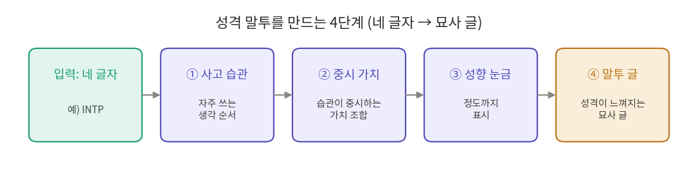
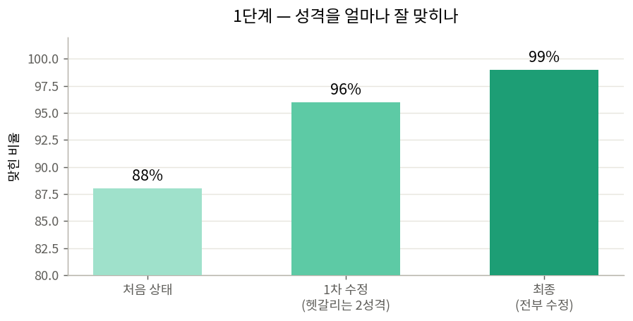
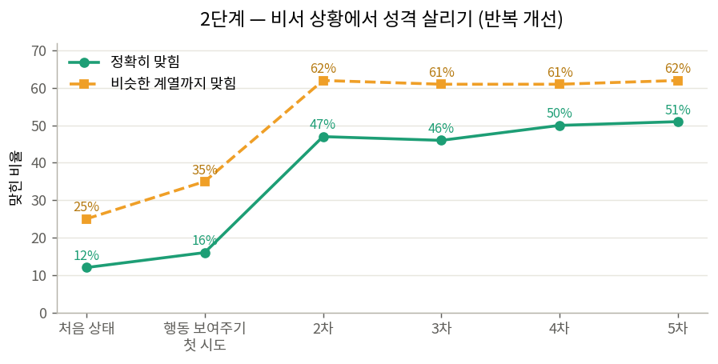
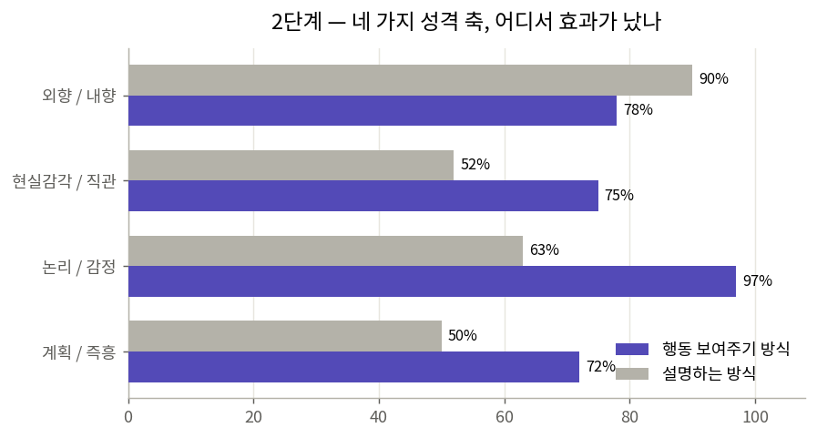
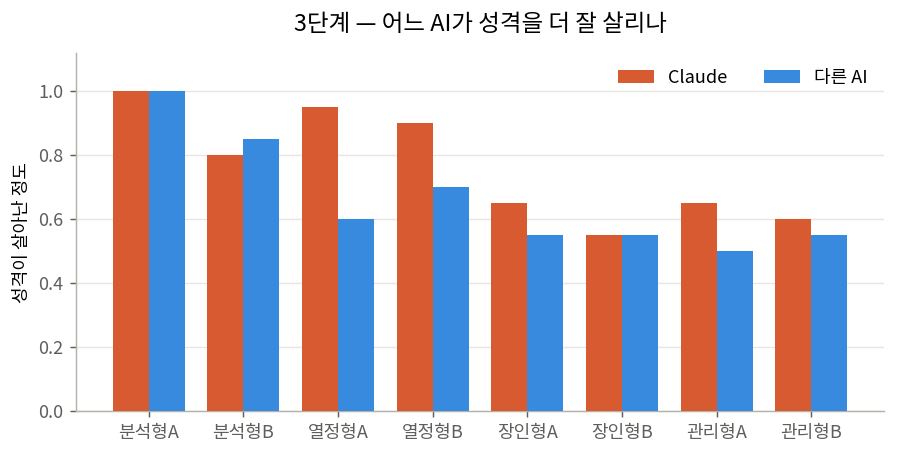

# 성격 말투 AI — 작업 정리본

이 프로젝트는 AI에게 **MBTI 16가지 성격 유형의 말투**를 입히고, 그게 실제로 그 성격처럼 느껴지는지를 점수로 확인하는 시스템이다.

확인 방법은 일종의 블라인드 테스트다. AI가 어떤 성격(예: INTP)인 척 답을 하면, 그 답에서 성격 이름표를 떼어내고 **다른 AI(채점자 역할)에게 "이거 무슨 성격 같아?"라고 물어본다.** 채점자가 원래 성격을 맞히면 "말투가 잘 살았다"는 뜻이다. 한 번만 물어보면 우연히 맞거나 틀릴 수 있어서, **매번 여러 번 반복해서 물어보고** 그 평균으로 본다.

작업은 크게 세 단계로 발전했다.

| 단계 | 한 일 | 결과 |
|---|---|---|
| 1. 성격 살리기 | 성격을 묻는 질문에서 말투가 잘 드러나게 | 적중률 88% → 99%, 16개 성격 전부 안정 |
| 2. 비서로 일할 때 | 평범한 비서 질문에 답할 때도 성격이 보이게 | 적중률 12% → 51%로 끌어올림 |
| 3. 속도·모델 고르기 | 어떤 AI를 쓰고 답을 얼마나 빨리 보낼지 | 용도별 AI 구분 · 답을 미리 만들어두는 방식 채택 |

---

## 0. 성격 말투는 어떻게 만들어지나

입력은 **네 글자 성격 하나(예: INTP)뿐이다.** 인터넷을 뒤지거나 외부에 물어보지 않고, 같은 성격을 넣으면 늘 같은 결과가 나오게 자동으로 만들어진다. 바탕이 되는 이론은 누구나 아는 공개 자료다 — 흔히 보는 MBTI 성격 검사(16Personalities 등)와, 각 성격이 세상을 어떻게 받아들이고 판단하는지를 설명하는 심리학 이론이다.

만드는 과정은 네 단계를 거친다.

**① 사고 습관 꺼내기.** 네 글자 성격마다, 그 사람이 평소 머릿속에서 가장 자주 쓰는 사고 방식의 순서가 정해져 있다. 예를 들어 INTP는 "논리를 정밀하게 따지기"가 1순위, "여러 가능성을 떠올리기"가 2순위 하는 식이다. 이 순서를 먼저 꺼낸다.

**② 중요하게 여기는 가치 뽑기.** 그 사고 습관들이 각각 무엇을 중시하는지를 모아 조합한다. 위 INTP라면 "논리적으로 앞뒤가 맞는 것", "깊이 이해하는 것", "새로운 아이디어" 같은 가치가 자연스럽게 나온다. 어디서 베껴온 설명이 아니라, 사고 습관의 뜻에서 그대로 따라 나오는 값이다.

**③ 성향을 눈금으로 표시하기.** 네 글자(외향/내향, 감각/직관, 논리/감정, 계획/즉흥)를 딱 둘로 나누지 않고, 각각 "얼마나 그쪽에 가까운지"를 눈금처럼 정도로 표시한다. 같은 내향이라도 살짝 내향인지 강한 내향인지를 담을 수 있다.

**④ 말투 글로 완성하기.** 앞의 ①~③을 바탕으로, 그 성격 특유의 **말투와 기질을 묘사하는 글**을 만든다. 이 묘사 글이 결과물의 핵심이고, 답변에서 성격이 실제로 느껴지게 하는 진짜 열쇠다.

네 글자는 각각 이런 축을 뜻한다.

| 글자 | 한쪽 | 다른 쪽 |
|---|---|---|
| 첫 글자 | E (바깥으로 에너지·외향) | I (안으로 에너지·내향) |
| 둘째 글자 | S (오감·현실 감각) | N (직관·가능성) |
| 셋째 글자 | T (논리·사고) | F (공감·감정) |
| 넷째 글자 | J (계획·정리) | P (유연·즉흥) |

**가장 중요한 발견은 이거다 — 성격을 살리는 건 숫자 설정값이 아니라 "묘사하는 단어"였다.** 실제로 성격의 강도를 강·중·약으로 바꿔봤지만 채점자의 반응은 거의 그대로였다. 그래서 어려운 성격은 그 성격만의 **남다른 특징을 글 맨 앞에 내세우는 식**으로 고쳤다(예: ISFP는 "손으로 만지고 직접 느끼는 감각"을 앞세움).

### 답변에 들어가는 세 가지 규칙

AI에게 주는 지시는 세 덩어리로 나뉜다. 첫째와 셋째는 모든 성격에 똑같이 들어가고, **둘째만 성격마다 다르다.**

| 덩어리 | 내용 |
|---|---|
| **① 정체성** | "나는 정직하고 유능한 AI다. AI라는 걸 숨기지 않는다." — 정확함과 도움이 최우선 |
| **② 말투** (성격별) | *어떻게* 말할지(톤·말투·강조점)만 정함. 무슨 내용을 말하는지나 정확성은 안 건드림 |
| **③ 안전·우선순위** | 안전 > 정확·도움 > 말투 순서. 아첨 금지, 위기 시 도움 자원 안내, 함부로 진단 금지 같은 보호장치 |

여기에 두 가지 스위치가 있다.

첫째는 **말투를 켜고 끄는 스위치**다. 켜두면 성격 말투(②)가 들어가고, 끄면 ②가 통째로 빠져서 어느 성격이든 똑같이 담백하게 답하는 **기본 모드**가 된다. 사용자가 "성격은 빼고 깔끔하게 답해줘" 하고 싶을 때 쓰는 장치다.

둘째는 **AI가 스스로 기본 모드를 권하는 신호**다. 성격 말투를 넣으면 답이 부정확해지거나 도움이 덜 될 것 같다고 판단되면, AI가 속으로 표시를 남기고 화면에는 "기본 모드로 보는 게 낫겠다"는 안내가 강조된다. 첫째 스위치가 사용자가 직접 끄는 거라면, 둘째는 AI가 알아서 "지금은 말투를 빼는 게 낫다"고 알려주는 셈이다. "정확함이 말투보다 우선"이라는 원칙을 말로만이 아니라 실제로 지키게 하는 안전장치가 바로 이 신호다.

---

## 1단계 — 성격을 묻는 질문에서 말투 살리기

기본 상태로 처음 재보니 평균 적중률이 88%였고, 16개 성격 중 13개가 안정적이었다. 문제는 일부 성격이었다 — 어떤 성격은 채점자가 한 번도 못 맞히고 비슷한 다른 성격으로 착각했다. 그래서 헷갈리는 성격들의 묘사 글을 손봤다. 핵심은 그 성격만의 **남다른 특징을 앞세운** 것이다(예: 어떤 성격은 "직접 보고 만지는 현실 감각"을, 다른 성격은 "겉으로 드러나는 활발함"을 강조).

결국 **16개 성격 전부 안정**으로 끌어올렸고, 고친 성격들은 더 여러 번 반복 테스트해서 믿을 만한지 다시 확인했다.

---

## 2단계 — "비서로 일할 때"라는 훨씬 어려운 문제

성격 질문이 아니라 **평범한 비서 상황**(날씨·와이파이·여행·점심 같은 질문에 답하기)에서도 성격이 드러나는지 재보니 적중률이 뚝 떨어졌다. 이유는, AI가 비서로 답하면 어느 성격이든 비슷비슷한 **무난한 비서 말투에 묻혀버리기** 때문이다. 채점자의 추측이 몇몇 특정 성격으로만 쏠렸다.

해결까지 안 되는 방법을 여럿 거쳤다. 성격을 억지로 부풀려도 별 효과가 없었고, 예시를 붙여주는 방법은 오히려 역효과였다. 게다가 이런 방법들은 하나같이 **"성격을 살리려다 비서로서의 정확함이 떨어지는"** 부작용이 있었다. 결국 성격을 설명으로 풀어 쓰는 대신, **그 성격이라면 실제로 어떻게 행동할지를 보여주는 방식**으로 방향을 틀었고, 이걸 여러 번 다듬어 적중률을 끌어올렸다.

어디서 효과가 났는지를 네 축으로 쪼개 보면 분명하다. **논리/감정, 감각/직관, 계획/즉흥을 가리는 정확도가 크게 올랐다.** "이 성격이라면 이렇게 행동한다"고 보여주니 이 세 가지가 또렷해진 것이다. 다만 **외향/내향을 가리는 건 오히려 더 어려워졌다** — 행동만 봐서는 그 사람이 활발한지 차분한지 알기 힘들다는 한계가 그대로 드러났다.

성격을 살리면서 비서로서의 정확함도 *완벽히 동시에* 지키는 것은 아직 끝까지 풀지 못한 숙제다. 다만 둘이 부딪칠 때를 대비한 안전장치는 마련해 뒀다. 성격 말투가 답의 정확성이나 유용성을 해칠 것 같으면 **AI가 스스로 "이번엔 말투를 빼고 담백하게 가는 게 낫겠다"고 판단해 기본 모드로 돌아가도록** 한 것이다. 즉 "정확함이 말투보다 우선"이라는 원칙이 충돌 상황에서 실제로 작동하게 해서, 적어도 성격을 살리려다 정확함을 잃는 일은 막아둔 셈이다.

---

## 3단계 — 어떤 AI를 쓰고, 얼마나 빨리 답할까

성격 말투를 어느 정도 살린 뒤, "그럼 실제로 어떤 AI를 쓰고 답을 어떻게 빨리 보낼까"로 관심이 옮겨갔다.

먼저 **두 AI를 비교**했다 — Claude와 다른 회사 AI(GPT 계열의 작은 모델). 일반 작업의 속도와 정확함은 GPT 쪽이 거의 모든 경우에서 더 빨랐고 정확도는 비슷했다. 반대로 **성격 말투를 살리는 건 Claude가 더 나았고**, 특히 따뜻하고 감정이 풍부한 성격에서 차이가 컸다.

논리적이고 분석적인 성격은 두 AI가 비슷했는데, 따뜻한 감정형 성격에서 갈렸다. **상대 AI는 따뜻한 성격을 잘 못 살렸다.** 그래서 결론은 용도에 따라 나눠 쓰자는 것이다 — 빠른 일반 작업은 GPT 쪽, 성격 말투가 중요하면 Claude.

다음은 **답을 얼마나 빨리 보내느냐**다. 사용자가 답을 받기까지 체감하는 대기 시간을 줄이기 위해 몇 가지 방식을 비교했다. AI 모델만 가벼운 걸로 바꿔도 어느 정도 줄지만 그것만으로는 부족했다. 그래서 택한 방식이 **답을 미리 만들어두는 것**이다 — 사용자가 더 자세한 답을 누르기 전에 미리 준비해 두면, 막상 눌렀을 때 기다림이 크게 줄어든다.

---

## 한 줄 정리

AI에게 16가지 성격 말투를 입히고 그게 잘 통하는지 점수로 확인하는 시스템을 만들었다. 성격 질문에서는 거의 완벽(88→99%)하게 다듬었고, 훨씬 어려운 비서 상황에서는 "행동으로 보여주는" 방식으로 12→51%까지 끌어올렸으며, 용도별 AI 선택과 답을 미리 만들어두는 전송 방식까지 정리했다. 성격을 살리면서 정확함도 그대로 지키는 건 완벽히 풀진 못했지만, 둘이 부딪칠 때 정확함이 이기도록 기본 모드로 돌아가는 안전장치는 마련해 뒀다. 아직 남은 숙제는 **외향/내향 구분**과, **성격과 정확함을 한 번에 둘 다 끌어올리는 것**이다.
